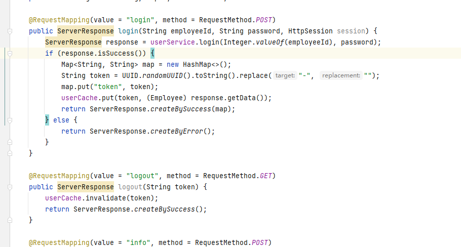

# Java毕业设计——汽车销售系统  

#### 介绍

联系作者
这是作者的微信二维码


如需本项目源代码，可扫码联系联系作者,
17502188708微信同号， **联系作者查看项目演示** 

 

### 系统截图展示


###  登录 

  

### 销售管理

  

### 客户管理

  

### 库存管理


### 财务报表


  

### 员工管理


#### 介绍

-  **SpringBoot2.X VUE2.6 Antd1.7.2 MyBatisPlus Shiro1.5.0 Java1.8 管理系统  可作为毕业设计和快速开发 **

-  项目所用技术

- ####  前端技术

  1. Antd-VUE
  2. 页面,按钮级别权限控制。
  3. 多个组件封装，调用方便。
  4. Antv图表组件。
  5. WebPack
  6. ES6
  7. 多环境打包。
  8. VUE路由，过滤器，自定义指令。
  9. 代码简洁，符合编码规范。

- ####  后端技术

  1. SpringBoot2.x
  2. Shiro权限框架
  3. Redis6.X最新版
  4. MyBatis注解版
  5. MySQL6.7
  6. 分模块开发，自定义启动脚本，JVM调优
  7. 多环境,前后端完全分离。
  8. 代码生成器。
  9. orika传输对象映射器。

- ####  项目代码展示

  ### 前段代码

  

  ### 后端代码

  

#### 

####  安装教程

 #### **后端安装方法**

```
1.  mvn clean package
2.  tar -zxvf carsale.tar.gz (解压tar包)
3.  cd carsale
5.  sh /sbin/startup.sh dev
```

####  前端安装方法

```
1.  yarn install (安装node_moudle)
2.  yarn start (启动)
3.  yarn build:prod (构建生产包)
```


